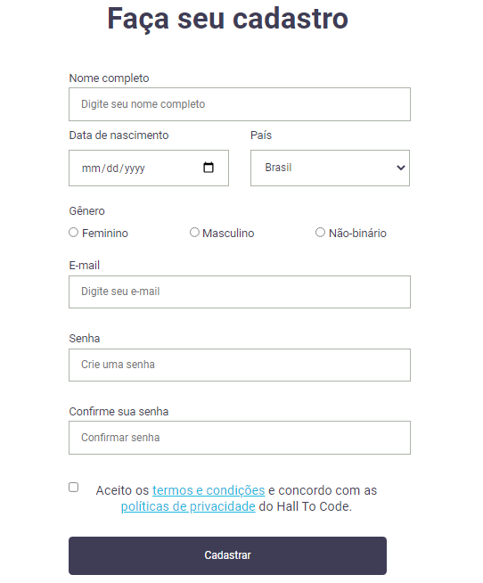

<html>
  <head>
    <link href="readme_style.css" rel="stylesheet">
  </head>
  <body>
    
Tentei me aproximar ao máximo do layout original, mas o botão de cadastro não quis colaborar comigo :(

    
Ainda me confundo MUITO com os detalhes do CSS, com certeza é minha maior dificuldade no momento e o que me impediu de deixar o botão igual ao resto das       caixas. Mas quero voltar aqui pra melhorar o resultado!

    
  </body>
</html>
